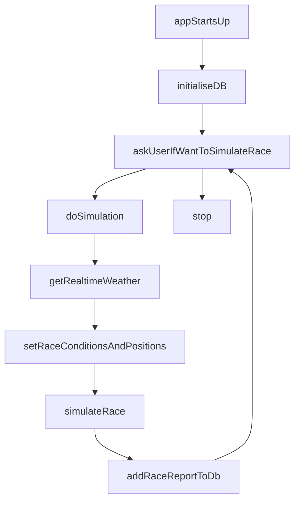
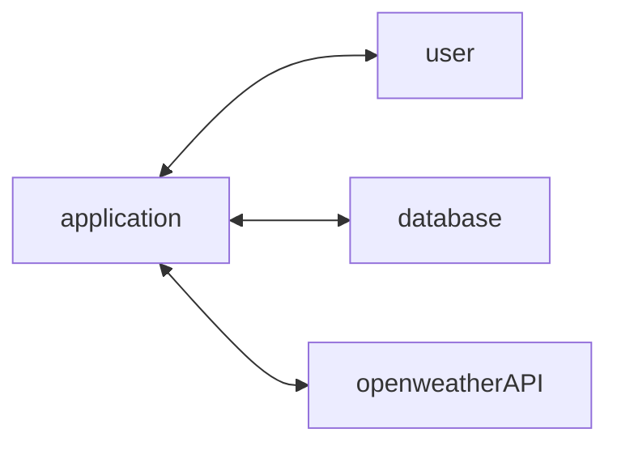
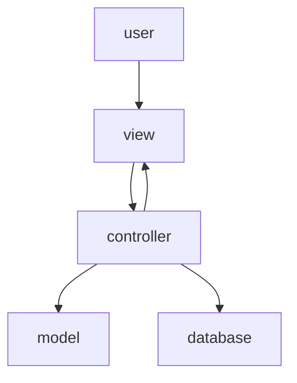

# f1 simulator 🏎️
### WIP 🛠️
A C# project to develop my use of C#, from a java/spring background. The program simulates an f1 race, currently using a mixture of arbitrary data, manually input values, and live (weather) data gathered from apis.

# Service Flow 

### General Flow

### High Level Architecture

    
Diagram

### Inner Workings of the Application

    
Diagram

## Running the program

### Database
_Currently a manual setup process, with views to automate the setup in the future_
- Connect to your local datasource (e.g. if using Rider, follow the instructions here https://www.jetbrains.com/help/rider/MySQL.html#connect-to-mysql-database)
- Create a database: `CREATE DATABASE f1_simulator;`
- The program will then initialise the database for you. 

### Secrets/keys
To call the OpenWeather API, you need an api key. To obtain this, you'll need to open an account with [OpenWeather](https://home.openweathermap.org/users/sign_in), and generate an api key. 

Once you've done that, to use that key within the application: 
- Configure your api key within secrets.json
- This must be within the Controller -> https://blog.jetbrains.com/dotnet/2023/01/17/securing-sensitive-information-with-net-user-secrets/ 

### Other
- This application uses .NET 8.0, and was developed using [Rider](https://www.jetbrains.com/rider/). 